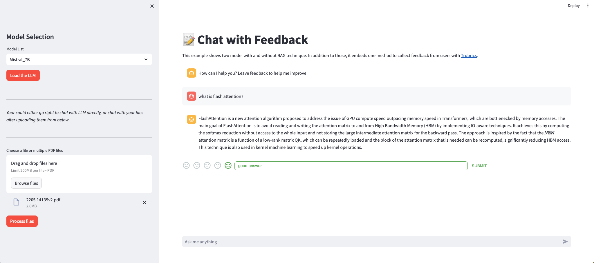

<p style="text-align: center;"><b>A StreamLit Project Powered by Llama_index and MLX</b></p>

## Description


This project uses components provided by StreamLit to develop the frontend. By using Apple's 
new machine learning toolkit MLX, this app can load and run large language models (LLMs) swiftly and 
conveniently. The contributions of this project are:

- capable of running the models locally using Apple's MLX on Apple silicon.
- provide a simple "chat with your pdf" function which utilizes the sentence window method to do its RAG job
and a simple naive chat implementation.
- embedded with Llama index by implementing its CustomLLM and can be directly used with other tools and 
packages of Llama index to accelerate development.
- try to add Trubrics' feedback support to conversations to gather data


## Usage

### Dependencies:
```python
pip install -r requirement.txt
```
after setting the parameters in "/.streamlit/secrets.toml" and "./config/model.yaml":

```python
streamlit run main_user_feedback.py
```
here we go.
### Models

The models(both llm and embedding model) can be define in the [config file](./config/model.yaml). 
Follow the format, 
but some code for dealing with model hyper parameters is still to be added. The model 
path can be either from Huggingface repo or your local location.

### [Trubrics]( https://trubrics.streamlit.app/)

Before using the feedback collecting, you have to register an ID of Trubrics. In addition to that,
it is worth to mention that Trubrics won't work in environment without internet connection and 
**some places without access to google's products** :dog:.

### Future work
- [ ] Agent application examples
- [ ] more RAG method will be added
- [ ] probably a new UI. Sorry, the current UI is so ugly and the control flow seems a little weird,
partly because of my terrible understanding of streamLit.
- [ ] The feedback part is still under improvement for it dosen't work well, sometimes it will drag down 
the performance of the APP and sometimes it will crash due to request exception...

In the end, thanks to the Apple's machine learning team for the powerful tool MLX and its tool family.
It provides more potentials for personal application developer.

### Update
- [x] Update LocalLLMOnMLX class with
- able to accept self-define chat template of tokenizer;
- able to self-define the temperature of the model;
